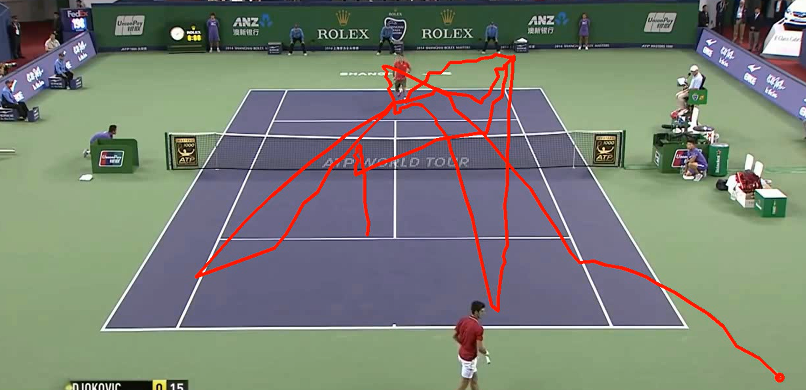

# Tennis Ball Tracking


## [Live Inference](https://huggingface.co/spaces/JakeHarveyy/tennis-ball-tracker)

A computer vision application designed to detect and track tennis balls in video footage. This project leverages deep learning models—specifically **YOLOv8** and **TrackNet**—to provide accurate tracking of small, fast-moving objects in sports scenarios.

The application features a **FastAPI** backend for efficient processing and a **Streamlit** frontend for an interactive user experience.

## 🚀 Features

- **Dual Model Support**:
  - **YOLOv8**: General-purpose object detection model fine-tuned for tennis balls.
  - **TrackNet**: Specialized deep learning network designed for tracking small objects in high-speed sports.
- **Interactive Web Interface**: Upload videos, select models, and view results directly in your browser.
- **Video Processing Pipeline**: Automatic video conversion and annotation with tracking overlays.
- **Containerized Deployment**: Fully Dockerized for easy setup, supporting both single-container (Hugging Face Spaces) and multi-container (Docker Compose) deployments.

## 🛠️ Tech Stack

- **Language**: Python 3.10+
- **Deep Learning**: PyTorch, Ultralytics (YOLO)
- **Computer Vision**: OpenCV, FFmpeg
- **Backend**: FastAPI, Uvicorn
- **Frontend**: Streamlit
- **Infrastructure**: Docker, Docker Compose

## 🏁 Getting Started

You can run this project using Docker (recommended) or by setting up a local Python environment.

### Option 1: Docker Compose (Recommended)

This method spins up the API and UI as separate services, mirroring a production microservices architecture.

1.  **Clone the repository:**
    ```bash
    git clone https://github.com/yourusername/tennis-ball-tracking.git
    cd tennis-ball-tracking
    ```

2.  **Start the services:**
    ```bash
    docker-compose up --build
    ```

3.  **Access the application:**
    - **Frontend (Streamlit):** [http://localhost:8501](http://localhost:8501)
    - **Backend Docs (Swagger UI):** [http://localhost:8000/docs](http://localhost:8000/docs)

### Option 2: Local Installation

If you prefer running directly on your machine, ensure you have **Python 3.10+** and **FFmpeg** installed.

1.  **Install System Dependencies:**
    - **Windows**: Download and install [FFmpeg](https://ffmpeg.org/download.html), ensuring it's added to your system PATH.
    - **Linux (Ubuntu/Debian)**: `sudo apt-get install ffmpeg`
    - **macOS**: `brew install ffmpeg`

2.  **Install Python Dependencies:**
    ```bash
    pip install -r requirements.txt
    ```
    *Note: For GPU support, install the appropriate PyTorch version from [pytorch.org](https://pytorch.org/).*

3.  **Run the Backend API:**
    Open a terminal and run:
    ```bash
    uvicorn src.app.main:app --reload --port 8000
    ```

4.  **Run the Frontend UI:**
    Open a second terminal and run:
    ```bash
    streamlit run src/app/ui.py
    ```

## 📂 Project Structure

```
.
├── data/                   # Data storage
│   ├── outputs/            # Processed videos
│   └── uploads/            # Uploaded raw videos
├── models/                 # Model weights
│   ├── tracknet/           # TrackNet model files
│   └── yolo/               # YOLOv8 weights (best.pt)
├── src/
│   ├── app/                # Application logic
│   │   ├── main.py         # FastAPI backend entry point
│   │   └── ui.py           # Streamlit frontend entry point
│   ├── trackers/           # Tracking algorithms
│   │   ├── tracknet/       # TrackNet implementation
│   │   └── yolo/           # YOLO implementation
│   └── config.py           # Configuration settings
├── Dockerfile              # Single-container build definition
├── docker-compose.yml      # Multi-container orchestration
└── requirements.txt        # Python dependencies
```

## 🧠 Models

The project expects model weights to be placed in the `models/` directory.

- **YOLOv8**: Place your trained `.pt` file at `models/yolo/best.pt`.
- **TrackNet**: Place your model weights at `models/tracknet/best.pt` (or update `src/config.py` to match your path).

## 🤝 Contributing

Contributions are welcome! Please feel free to submit a Pull Request.

1.  Fork the project
2.  Create your feature branch (`git checkout -b feature/AmazingFeature`)
3.  Commit your changes (`git commit -m 'Add some AmazingFeature'`)
4.  Push to the branch (`git push origin feature/AmazingFeature`)
5.  Open a Pull Request

## 📄 License

This project is licensed under the MIT License - see the [LICENSE](LICENSE) file for details.
